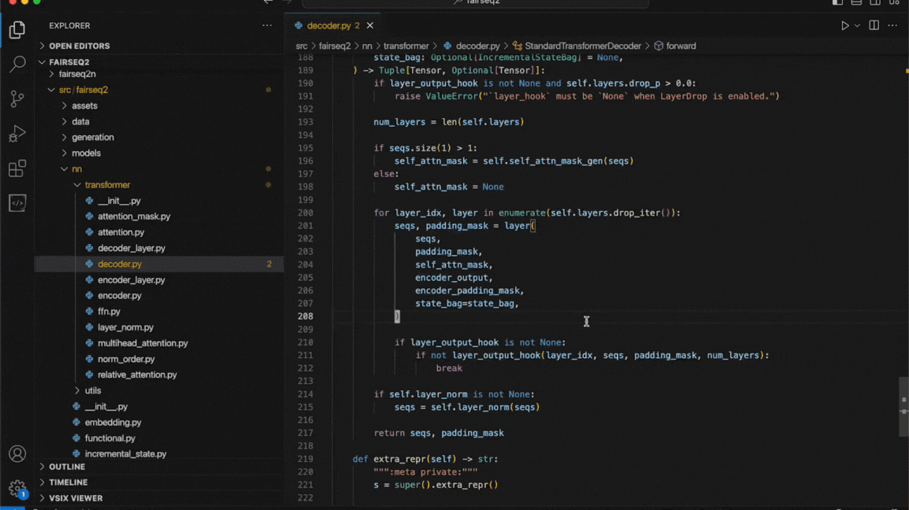

# Snip Notes

Enhance your coding experience by seamlessly integrating notes right within VSCode! \
Just highlight a code segment, add your insights, and then view them organized in your sidebar.

## 🎥 Demo

## 🌟 Features
* Attach Notes to Code: Make personal annotations and jot down ideas, to-dos, or necessary fixes.
* Search Through Notes: Quickly find the information you need with a search bar.
* Edit Notes On-The-Fly: Update both note content and title without the need to open a new window.
* Jump To Code: Click on a note to navigate directly to the corresponding line in your code.

## 🚀 Usage
* Select the code you wish to annotate.
* Open the command palette and execute the `Create Note` command.
* Jot down your thoughts, ideas, or reminders.
* View, search, edit, or click to jump right from the sidebar!
* View all your notes from the entire workspace in a structured treeview